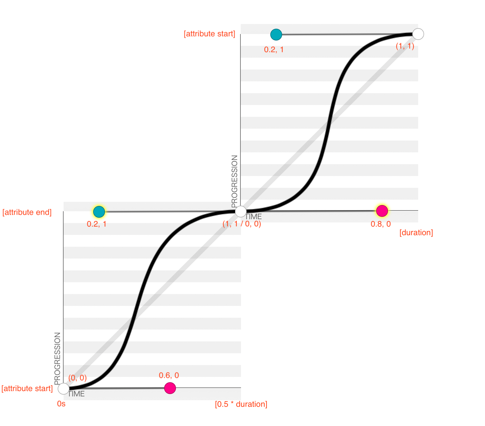
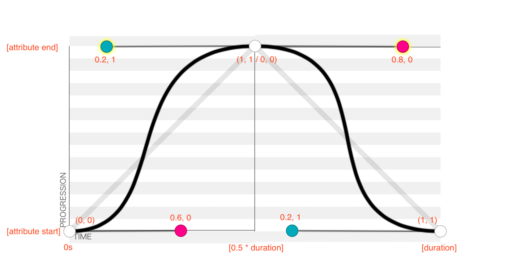

# react-ring-spinner

[](https://www.npmjs.com/package/react-ring-spinner)
[](https://www.npmjs.com/package/react-ring-spinner)
[](https://travis-ci.org/rcwbr/react-ring-spinner)
[](https://coveralls.io/github/rcwbr/react-ring-spinner?branch=master)
[](https://david-dm.org/rcwbr/react-ring-spinner)
[](https://david-dm.org/rcwbr/react-ring-spinner?type=dev)
[](https://snyk.io/test/github/rcwbr/react-ring-spinner)
[](https://opensource.org/licenses/MIT)
[](https://standardjs.com)
[](https://github.com/RichardLitt/standard-readme)


> The `react-ring-spinner` package defines a RingSpinner component, which renders an SVG circle loading spinner, animated using SVG animations.

`react-ring-spinner` is the default spinner used by [`react-element-placeholder`](https://github.com/rcwbr/react-element-placeholder) Placeholder components.

## Table of Contents

- [Install](#install)
- [Usage](#usage)
- [Development](#development)
- [API](#api)
  - [Key splines explanation](#key-splines-explanation)
- [Maintainers](#maintainers)
- [Contribute](#contribute)
- [License](#license)

## Install

``` Bash
npm install react-ring-spinner
```

## Usage

See [react-element-placeholder Placeholder component](https://github.com/rcwbr/react-element-placeholder/blob/master/src/components/Placeholder/index.jsx) for a usage example.

### Default usage:
``` JS
import RingSpinner from 'react-ring-spinner'

render () {
  return <RingSpinner />
}
```
Which renders this:


### Usage with property overrides:
``` JS
import RingSpinner from 'react-ring-spinner'

render () {
  return <RingSpinner
    // option={value}
    // option={value}
    // ...
  />
}
```
See the [API](#api) for documentation of all properties.

## Development

To set up to lint this package with [Atom](https://atom.io):
* Install the `linter-eslint` plugin, and its dependencies.
* Open your Atom `config.cson` by pressing `cmd + shift + p` and typing 'config'
* Under `linter-eslint`, add `autofix: fixOnSave: true`
  * Now it should look like this:
  ```JS
    "linter-eslint":
      autofix:
        fixOnSave: true
  ```

## API

Example usage with all properties overridden. The values shown are the defaults.
``` JS
import RingSpinner from 'react-ring-spinner'

render () {
  return <RingSpinner
    backgroundColor={'rgba(0, 0, 0, 0.9)'}
    duration={'1s'}
    keySplinesIn={'0.6 0 0.2 1'}
    keySplinesOut={'0.8 0 0.2 1'}
    opacityAnimationDelay={'0.35s'}
    ring1Color={'white'}
    ring2Color={'white'}
    ringsOpacityMax={0.9}
    ringsOpacityMin={0.3}
    ringsRadiusMax={45}
    ringsRadiusMin={30}
    ringsStrokeWidth={'3px'}
  />
}
```

This returns an SVG element with a background color and two unfilled circle elements. The circle elements have animations for both their radii and opacities. The same animations apply to both rings, but the rings start from opposite states (both in radius and opacity) such that their animations remain in antiphase.

### RingSpinner properties
Property | Type | Default | Description
:--------|:----:|:-------:|:-----------
backgroundColor | string -- CSS color | `'rgba(0, 0, 0, 0.9)'` | The background color of the spinner SVG element.
duration | string -- CSS time | `'1s'` | Time length of one full spinner animation, i.e. the time in which one ring grows (or shrinks), and then reverses and returns to its original radius. Depending on the desired animation, `opacityAnimationDelay` should be scaled proportionally with this property.
keySplinesIn | string -- [cubic-bezier](http://cubic-bezier.com) control points | `'0.6 0 0.2 1'` | The control points which define the progress of the radius and opacity animations over time, during the phase in which the radius grows and, delayed by `opacityAnimationDelay`, the opacity reduces. See [Key splines explanation](#key-splines-explanation) below for details of how this property affects the animations.
keySplinesOut | string -- [cubic-bezier](http://cubic-bezier.com) control points | `'0.8 0 0.2 1'` | The control points which define the progress of the radius and opacity animations over time, during the phase in which the radius shrinks and, delayed by `opacityAnimationDelay`, the opacity increases. See [Key splines explanation](#key-splines-explanation) below for details of how this property affects the animations.
opacityAnimationDelay | string -- CSS time | `'0.35s'` | The delay between ring radius and ring opacity animations. With default properties, this causes the rings to become nearly opaque before growing (and nearly translucent before shrinking), rather than changing simultaneously. To maintain this effect, this property should be scaled proportionally with any change to `duration`.
ringColor1 | string -- CSS color | `'white'` | The color of the ring that is on the inside of the spinner when the animation starts.
ringColor2 | string -- CSS color | `'white'` | The color of the ring that is on the outside of the spinner when the animation starts.
ringsOpacityMax | number - CSS opacity | `0.9` | The maximum opacity (between 0 and 1, inclusive) to which the rings will fade.
ringsOpacityMin | number - CSS opacity | `0.3` | The minimum opacity (between 0 and 1, inclusive) to which the rings will fade.
ringsRadiusMax | number | `45` | The maximum radius, as a percent of the SVG canvas, to which the rings will grow.
ringsRadiusMin | number | `30` | The minimum radius, as a percent of the SVG canvas, to which the rings will shrink.
ringsStrokeWidth | string -- CSS length | `'3px'` | The stroke width of the spinner rings.

### Key splines explanation
By default, the radius and opacity attributes are animated to progress not linearly, but rather following a function mapping animation time (x) values to attribute progress (y) values. Within one animation, the attributes range from the given start, to the given end, _and back_ -- this is defined by a `values='[attribute start]; [attribute end]; [attribute start];'` animation property. Additionally, the animations reach the start, end, and start (again) values at time 0, time `0.5 * duration`, and time `1 * duration`, respectively -- this is defined by a `keyTimes='0; 0.5; 1'` animation property.

The value of the animated attributes at times between the `keyTimes` are given by [cubic B&eacute;zier curves](https://en.wikipedia.org/wiki/Bézier_curve#Cubic_Bézier_curves) -- one curve between the 0 and 0.5 times, and another between the 0.5 and 1 times. The `keySplinesOut` and `keySplinesIn` properties define one curve each, applied respectively to the 0-0.5 duration and the 0.5-1 duration for the first ring (see the `ringColor1` property), and vice-versa for the second ring.

The `keySplinesOut` and `keySplinesIn` properties control the curvature of the B&eacute;zier curves. Their values are coordinates (in x1, y1, x2, y2 order) of, respectively, the second and third control points of a cubic B&eacute;zier curve. The first and fourth control points are always (0, 0) and (1, 1). The curve axes are time (x) and attribute value (y). The curve control points have no units because they shape the curve, but do not precisely define points along it.

The tool at [cubic-bezier.com](http://cubic-bezier.com) provides excellent visualization of how the control points affect animation progress. The following graphic shows the default RingSpinner B&eacute;zier curves, as they play through one `duration`. The graphic shows the second curve starting at the end of the first; this is chronologically correct, but places the second curve in a new coordinate system, offset from that of the first curve.
```
values='[attribute start]; [attribute end]; [attribute start]; // values for radius or opacity attributes
keyTimes='0; 0.5; 1' // factors of duration
keySplines='0.6 0 0.2 1; 0.8 0 0.2 1' // values from '[keySplinesIn]; [keySplinesOut]'
```


Note that the second curve returns the attribute to its start value. Vertically reflecting the graph for the second curve preserves the attribute value as the y axis, but also inverts the numeric scale of the second curve, such that the curve point coordinate systems are both translationally and rotationally offset:



For more on SVG animations, see [A Guide to SVG Animations on CSS Tricks]((https://css-tricks.com/guide-svg-animations-smil/), especially the [calcMode and keySplines section](https://css-tricks.com/guide-svg-animations-smil/#article-header-id-12) for details of cubic B&eacute;zier animation timing.

## Maintainers

[@rcwbr](https://github.com/rcwbr)

## Contribute

PRs accepted.

Small note: If editing the README, please conform to the [standard-readme](https://github.com/RichardLitt/standard-readme) specification.

## License

MIT © 2019 Eric Weber
